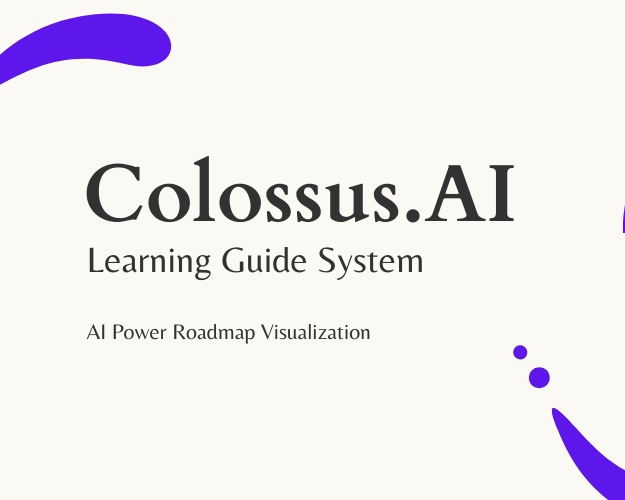
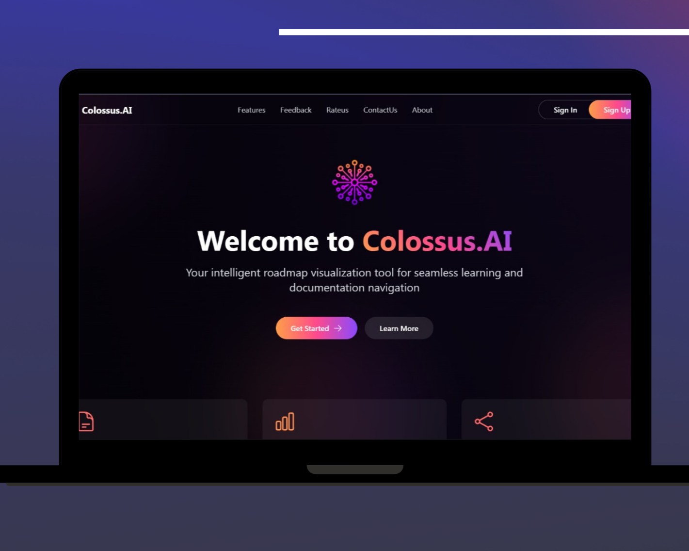

# ColossusAI - AI-Powered Learning Platform

  
   
  <em>AI-Powered Learning, Smarter Knowledge Navigation</em>

## 📚 About ColossusAI

ColossusAI is an innovative learning platform that transforms how you interact with information. Using advanced AI technology, we create visual roadmaps from your documents, making learning more intuitive and engaging. Our platform helps you navigate complex knowledge with ease, whether you're a student, researcher, or professional.

  

## ✨ Key Features

### 🔮 AI-Powered Knowledge Graphs

Visual roadmaps generated from your documents for easier learning
- Automated graph generation
- Interactive visualization
- Semantic relationship mapping
- Real-time updates

### 🔍 Intelligent Search & Query

Enter queries in natural language to find relevant insights quickly
- Natural language processing
- Semantic search
- Context-aware results
- Quick filtering options

### 📄 Smart Document Management

Upload and organize documents with ease for efficient access
- Drag-and-drop upload
- Automatic categorization
- Version control
- Advanced search capabilities

## 🖼️ Screenshots

  
   
  <em>AI-Powered Knowledge Graph Visualization</em>

  
   
  <em>Interactive Document Management & Document Analysis</em>

## 🛠️ Technologies Used

### Frontend
-  **React.js** - UI components and state management
-  **Next.js** - Server-side rendering and routing
-  **TypeScript** - Type-safe code
-  **Tailwind CSS** - Styling and responsive design
-  **Framer Motion** - Animations and transitions
-  **Three.js** (@react-three/fiber, @react-three/drei) - 3D visualizations

### UI Components
-  **Radix UI** - Accessible UI primitives
-  **Lucide React** - Icon library
-  **Heroicons** - Additional icon set

### Backend
-  **Node.js** - Server environment
-  **Nodemailer** - Email functionality

### AI Integration
-  **OpenAI API** - AI-powered features

### Deployment
-  **Heroku** - Cloud hosting platform

## 🌐 Connect With Us

  
  
  
  
  
  
  

  

## 🔗 Quick Links

- [Official Website](https://www.colossusai.net/)
- [Help Center](https://www.colossusai.net/contactus#contact-form)
- [Terms of Service](https://www.colossusai.net/terms-of-service)
- [Privacy Policy](https://www.colossusai.net/privacy-policy)
- [FAQ](https://www.colossusai.net/#faq)

## 📊 Competitive Edge

ColossusAI stands out from competitors with our comprehensive feature set:

| Feature | ColossusAI | Other Platforms |
|---------|------------|-----------------|
| AI-Powered Document Analysis | ✅ | Limited or missing |
| Knowledge Graph Generation | ✅ | Often manual or basic |
| Automatic Information Linking | ✅ | Rarely automated |
| Interactive Visualizations | ✅ | Static in many cases |
| Natural Language Queries | ✅ | Keyword-based in most |

## 🚀 Getting Started

Visit [ColossusAI](https://www.colossusai.net/) and sign up for an account to begin your enhanced learning journey today!

  
   
  <em>ColossusAI is available on all devices</em>

## 👥 Team

Our dedicated team of developers, designers, and AI specialists work tirelessly to create the best learning experience possible.

  

  <table>
    <tr>
      <td align="center">
        
         
        <b>Ruhan</b>
      </td>
      <td align="center">
        
         
        <b>Tharana</b>
      </td>
      <td align="center">
        
         
        <b>Sudesh</b>
      </td>
    </tr>
    <tr>
      <td align="center">
        
         
        <b>Pasidu</b>
      </td>
      <td align="center">
        
         
        <b>Chiran</b>
      </td>
      <td align="center">
        
         
        <b>Akila</b>
      </td>
    </tr>
  </table>

## 📄 License

© 2025 Colossus.AI. All rights reserved. 
